```r
library(tidyverse)
library(MASS)
library(readxl)
library(randomForest)
```

# Context on Process
The analysis and modeling was done both in R and Python which interms provides interesting insights as to how language specific packages yield potentially different different models. To view the executed python code please look at case_study_two.md. The python code here is not executed but the output is provided.

<center><h1>Pre-Process Data</h1></center>

### In R

The main steps we took in cleaning the data was to remove the columns that behaved like constants (i.e., they had the same value for all observations), and transform columns into factors that were incorrectly imported as character data types.

We also split our data into training and test sets (using a 80/20 split) in order to test the accuracy of various models that were utilized.

```r
# --- Import data.
df <- read_xlsx("CaseStudy2data.xlsx", col_names = TRUE)
```

```
## Warning in strptime(x, format, tz = tz): unknown timezone 'zone/tz/2018c.
## 1.0/zoneinfo/America/Denver'
```

```r
# --- Transform data.
# Transform character types to factors.
df <- cbind(df[,-c(2,3,5,8,12,16,18,22,23)],lapply(df[,c(2,3,5,8,12,16,18,22,23)], as.factor))
# Create X matrix by removing the response, employee number, over 18 (factor with 1 level). We also removed
# employee count and standard hours for having constant values.
X.df <- df[,-c(5,6,18,27,34)]
# Create y vector.
y.df <- as.factor(df$Attrition)
# Combine these two for functions that require the full data frame. Then rename the response column.
df.new <- cbind(X.df, y.df)
names(df.new)[names(df.new) == 'y.df'] <- 'Attrition'

# --- Split data into training and test sets.
set.seed(5)
train <- sample(1:dim(X.df)[1], dim(X.df)[1]*0.8)
test <- -train
```

### In Python


```pcleanup
file = 'CaseStudy2data.xlsx'

# Load spreadsheet
xl = pd.ExcelFile(file)

# Load a sheet into a DataFrame by name: df1
unchanged_attrition_df = xl.parse('HR-employee-attrition Data')
attrition_df = unchanged_attrition_df

# drop unneccessary columns with constant values
attrition_column = attrition_df["Attrition"]
attrition_df.drop("Attrition", axis=1, inplace=True)
attrition_df.insert(0, "Attrition", attrition_column)
attrition_df.drop('EmployeeCount', axis=1, inplace=True)
attrition_df.drop('StandardHours', axis=1, inplace=True)
attrition_df.drop('Over18', axis=1, inplace=True)

# convert attrition variable to binary
attrition_df = attrition_df.replace("Yes", 1)
attrition_df = attrition_df.replace("No", 0)

# code dummy variables, this is necessary to use sklearn
attrition_df = pd.get_dummies(attrition_df, columns=["BusinessTravel", "Department", "EducationField", "Gender", "JobRole", "MaritalStatus"], prefix=["BusinessTravel", "Department", "EduationField", "Gender", "JobRole", "MaritalStatus"])
df_without_attrition = attrition_df.drop("Attrition", axis=1)
columns_without_attrition = df_without_attrition.columns
columns_with_attrition = attrition_df.columns

# split test and train set
rand = np.random.rand(len(attrition_df)) < 0.8

train = attrition_df[rand]
test = attrition_df[~rand]
```

<center><h1>Exploratory Data Analysis</h1></center>
*Conducted in Python*


```pheatmap
# provide squares for correlation heatplot for values above +/- .6
plt.figure(figsize = (20,20))
corr = attrition_df.corr()
sns.heatmap(corr[(corr >= 0.6) | (corr <= -0.6)], 
        xticklabels=columns_with_attrition,
        yticklabels=columns_with_attrition, linewidths=.6)
```
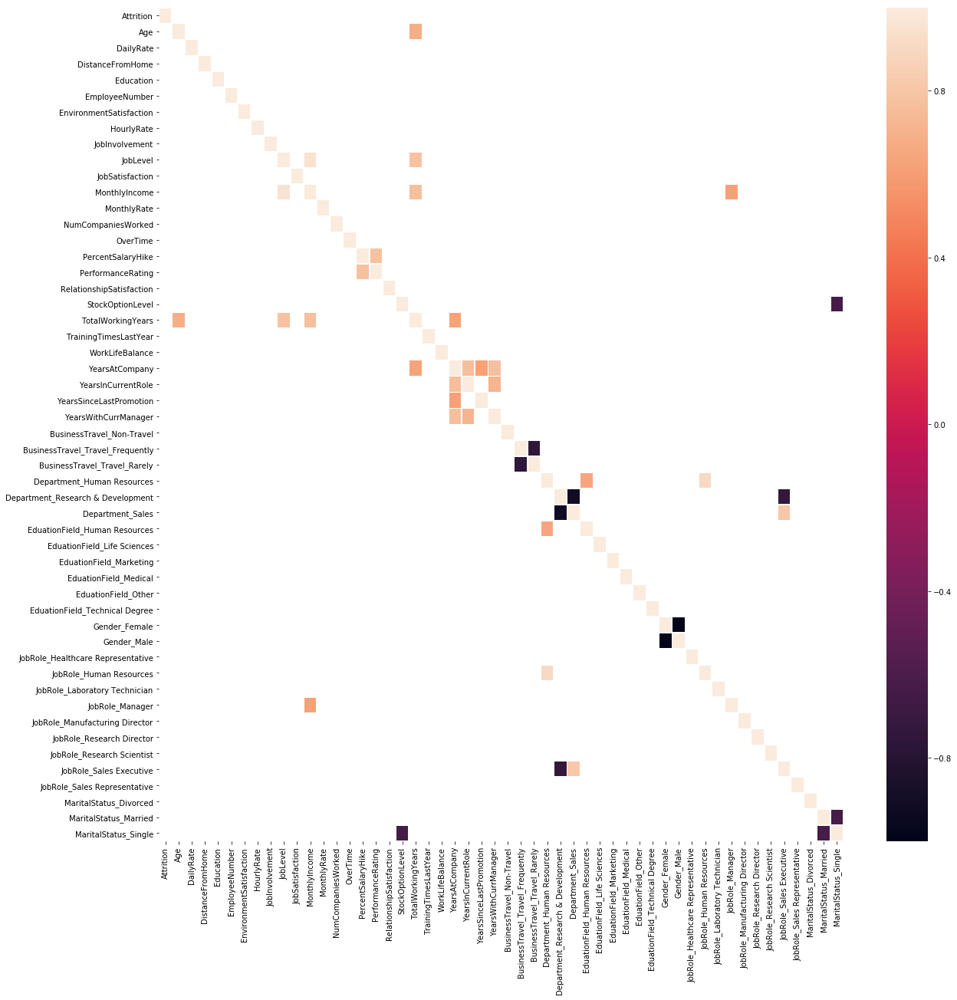

Based off looking at the correlation heatmap above, there are not any values that stand out as extremly correlated (0.8). Thus no variables will be removed.


```pattritioncounts
sns.countplot(x='Attrition',data=attrition_df)
plt.show()
```
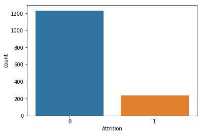

This is a look at the number of people who left their job vs the number of people who stayed. 


```pjobrolecounts
sns.countplot(y="JobRole", data=unchanged_attrition_df)
plt.show()
```
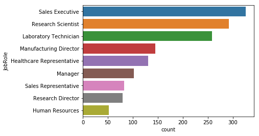

This is a look at the number of people in each Job Role.


```pjobroleattritioncounts
sns.countplot(y="JobRole", hue="Attrition", data=unchanged_attrition_df)
plt.show()
```
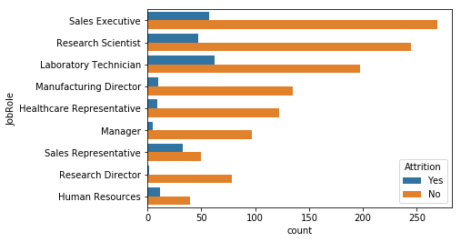

A look at the ratio of attrition for each Job Role.


```pmonthlyincomebyrolecounts
income = unchanged_attrition_df.groupby('JobRole').mean()[['MonthlyIncome']].values
flattened_income = []
for i in income:
    flattened_income.append(i[0])
    
roles = ['Healthcare Representative', 'Human Resources', 'Labrator Technician', 'Manager', 'Manufacturing Director', 'Research Director', 'Research Scientist' , 'Sales Executive','Sales Representative']

y_pos = np.arange(len(roles))

plt.xlabel('Average Monthly Income')
plt.ylabel('Job Role')
 
# Create horizontal bars
plt.barh(y_pos, flattened_income)
 
# Create names on the y-axis
plt.yticks(y_pos, roles)
 
# Show graphic
plt.show()
```
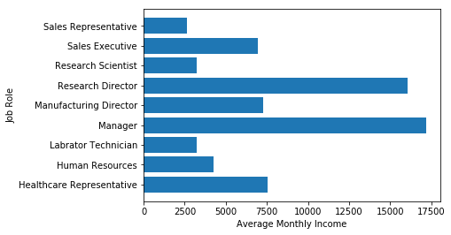

This is a look at the Average Monthly Income of respective Job Roles.

<center><h1>Modeling - Determine Most Influential Factors</h1></center>

### In R

#### Random Forrest Model

The four most important factors in predicting employee attrition per our random forest model are:
1. MonthlyIncome
2. Age
3. Overtime
4. DailyRate

Our random forest model also had 100% accuracy on the test set, which supports the fact that these four explanatory variables can definitely contribute to accurately predicting employee attrition (for comparison, the naive method of always predicting the majority class would lead to accuracy of 84.69%).

```r
# *** Random Forest ***
attr.rfor <- randomForest(X.df, y.df, mtry = ceiling(sqrt(dim(X.df)[2])), subset = train)
importance(attr.rfor)
```

```
##                          MeanDecreaseGini
## Age                             24.432207
## DailyRate                       21.834971
## DistanceFromHome                18.706080
## Education                        7.518235
## EnvironmentSatisfaction         11.477289
## HourlyRate                      19.188499
## JobInvolvement                   9.906432
## JobLevel                         7.901936
## JobSatisfaction                 10.807190
## MonthlyIncome                   29.896635
## MonthlyRate                     19.397993
## NumCompaniesWorked              12.892191
## PercentSalaryHike               14.308954
## PerformanceRating                1.872946
## RelationshipSatisfaction         9.130747
## StockOptionLevel                11.514440
## TotalWorkingYears               21.116766
## TrainingTimesLastYear            9.868945
## WorkLifeBalance                 10.218925
## YearsAtCompany                  15.570256
## YearsInCurrentRole               9.819039
## YearsSinceLastPromotion          9.686264
## YearsWithCurrManager            11.287641
## BusinessTravel                   7.192665
## Department                       4.071724
## EducationField                  13.125326
## Gender                           2.601294
## JobRole                         19.851146
## MaritalStatus                    8.801766
## OverTime                        22.924836
```

```r
# Calculate accuracy. Accuracy is 100%.
rfor.predict <- predict(attr.rfor, df.new[test,])
sum(rfor.predict == df.new$Attrition[test])/length(df.new$Attrition[test])
```

```
## [1] 1
```

#### Logistic Regression Model

Since random forest models do not provide p-values or coefficients, we tried fitting a logistic regression model to provide a little more interpretability. However, this model identified different variables as being important than our random forest model. The six most important variables (that were also statistically significant) from the logistic regression model were:
1. OverTime
2. BusinessTravel_Frequently
3. JobInvolvement
4. EnvironmentSatisfaction
5. JobSatsifaction
6. RelationshipSatisfaction.

The reason the variables that were identified as important through logistic regression were different from the random forest is due to different assumptions about the structure of the data when using logistic regression. The logistic regression model we applied assumes linearity, constant variance, independence, and also had no interaction terms.

In order to see which model more accurately represents the data, we calculate the accuracy of our logistic regression model on our test set and got 88.44% accuracy. Since this is lower than our random forest model, we would put more weight on the variables identified from our random forest model and conclude that some of the regression assumptions were violated. We can create a more advanced logistic regression model that corrects for some of these issues in the future if deemed necessary.

```r
# *** Logistic Regression ***

attr.logi <- glm(Attrition ~ ., family = binomial, data = df.new, subset = train)
summary(attr.logi)
```

```
## 
## Call:
## glm(formula = Attrition ~ ., family = binomial, data = df.new, 
##     subset = train)
## 
## Deviance Residuals: 
##     Min       1Q   Median       3Q      Max  
## -1.7379  -0.4700  -0.2387  -0.0811   3.4078  
## 
## Coefficients:
##                                    Estimate Std. Error z value Pr(>|z|)
## (Intercept)                      -9.278e+00  4.626e+02  -0.020 0.984000
## Age                              -2.090e-02  1.507e-02  -1.387 0.165441
## DailyRate                        -3.716e-04  2.516e-04  -1.477 0.139652
## DistanceFromHome                  4.366e-02  1.203e-02   3.630 0.000283
## Education                         2.654e-02  1.013e-01   0.262 0.793232
## EnvironmentSatisfaction          -5.207e-01  9.516e-02  -5.472 4.44e-08
## HourlyRate                        3.026e-04  5.073e-03   0.060 0.952431
## JobInvolvement                   -6.779e-01  1.429e-01  -4.744 2.10e-06
## JobLevel                         -1.645e-02  3.544e-01  -0.046 0.962974
## JobSatisfaction                  -3.825e-01  9.236e-02  -4.142 3.44e-05
## MonthlyIncome                     3.573e-05  9.182e-05   0.389 0.697191
## MonthlyRate                       1.169e-06  1.431e-05   0.082 0.934888
## NumCompaniesWorked                1.946e-01  4.383e-02   4.440 9.01e-06
## PercentSalaryHike                -1.016e-01  4.588e-02  -2.213 0.026865
## PerformanceRating                 6.925e-01  4.662e-01   1.485 0.137445
## RelationshipSatisfaction         -3.204e-01  9.307e-02  -3.443 0.000575
## StockOptionLevel                 -1.895e-01  1.869e-01  -1.014 0.310477
## TotalWorkingYears                -7.437e-02  3.241e-02  -2.295 0.021742
## TrainingTimesLastYear            -2.252e-01  8.374e-02  -2.690 0.007154
## WorkLifeBalance                  -4.275e-01  1.409e-01  -3.035 0.002409
## YearsAtCompany                    1.537e-02  4.778e-02   0.322 0.747671
## YearsInCurrentRole               -1.518e-01  5.408e-02  -2.807 0.005003
## YearsSinceLastPromotion           2.024e-01  4.915e-02   4.119 3.81e-05
## YearsWithCurrManager             -5.689e-02  5.546e-02  -1.026 0.304948
## BusinessTravelTravel_Frequently   1.700e+00  4.399e-01   3.864 0.000112
## BusinessTravelTravel_Rarely       7.090e-01  4.014e-01   1.766 0.077320
## DepartmentResearch & Development  1.194e+01  4.626e+02   0.026 0.979417
## DepartmentSales                   1.211e+01  4.626e+02   0.026 0.979118
## EducationFieldLife Sciences      -8.272e-01  1.067e+00  -0.775 0.438111
## EducationFieldMarketing          -3.052e-01  1.117e+00  -0.273 0.784740
## EducationFieldMedical            -8.638e-01  1.065e+00  -0.811 0.417204
## EducationFieldOther              -1.193e+00  1.139e+00  -1.047 0.294895
## EducationFieldTechnical Degree    2.462e-01  1.081e+00   0.228 0.819833
## GenderMale                        2.493e-01  2.097e-01   1.188 0.234675
## JobRoleHuman Resources            1.330e+01  4.626e+02   0.029 0.977061
## JobRoleLaboratory Technician      1.674e+00  5.530e-01   3.026 0.002478
## JobRoleManager                    5.799e-01  9.515e-01   0.609 0.542224
## JobRoleManufacturing Director     4.049e-01  6.078e-01   0.666 0.505248
## JobRoleResearch Director         -1.622e+00  1.266e+00  -1.281 0.200053
## JobRoleResearch Scientist         6.833e-01  5.629e-01   1.214 0.224813
## JobRoleSales Executive            7.748e-01  1.164e+00   0.665 0.505732
## JobRoleSales Representative       2.154e+00  1.232e+00   1.748 0.080412
## MaritalStatusMarried              2.766e-01  3.115e-01   0.888 0.374542
## MaritalStatusSingle               1.101e+00  4.091e-01   2.691 0.007116
## OverTimeYes                       1.858e+00  2.213e-01   8.396  < 2e-16
##                                     
## (Intercept)                         
## Age                                 
## DailyRate                           
## DistanceFromHome                 ***
## Education                           
## EnvironmentSatisfaction          ***
## HourlyRate                          
## JobInvolvement                   ***
## JobLevel                            
## JobSatisfaction                  ***
## MonthlyIncome                       
## MonthlyRate                         
## NumCompaniesWorked               ***
## PercentSalaryHike                *  
## PerformanceRating                   
## RelationshipSatisfaction         ***
## StockOptionLevel                    
## TotalWorkingYears                *  
## TrainingTimesLastYear            ** 
## WorkLifeBalance                  ** 
## YearsAtCompany                      
## YearsInCurrentRole               ** 
## YearsSinceLastPromotion          ***
## YearsWithCurrManager                
## BusinessTravelTravel_Frequently  ***
## BusinessTravelTravel_Rarely      .  
## DepartmentResearch & Development    
## DepartmentSales                     
## EducationFieldLife Sciences         
## EducationFieldMarketing             
## EducationFieldMedical               
## EducationFieldOther                 
## EducationFieldTechnical Degree      
## GenderMale                          
## JobRoleHuman Resources              
## JobRoleLaboratory Technician     ** 
## JobRoleManager                      
## JobRoleManufacturing Director       
## JobRoleResearch Director            
## JobRoleResearch Scientist           
## JobRoleSales Executive              
## JobRoleSales Representative      .  
## MaritalStatusMarried                
## MaritalStatusSingle              ** 
## OverTimeYes                      ***
## ---
## Signif. codes:  0 '***' 0.001 '**' 0.01 '*' 0.05 '.' 0.1 ' ' 1
## 
## (Dispersion parameter for binomial family taken to be 1)
## 
##     Null deviance: 1046.75  on 1175  degrees of freedom
## Residual deviance:  668.21  on 1131  degrees of freedom
## AIC: 758.21
## 
## Number of Fisher Scoring iterations: 14
```

```r
# Data frame of the most important variables.
Variable_Name <- c('OverTime','BusinessTravel_Freq','JobInvolvement','EnvironSatisfaction','JobSatisfaction','RelationshipSatisfaction')
Variable_Coef <- c(1.86, 1.70, abs(-0.678), abs(-0.521), abs(-0.383), abs(-0.320))
logi.df <- data.frame(cbind(Variable_Name, Variable_Coef))
logi.df <- transform(logi.df, Variable_Name = reorder(Variable_Name, order(Variable_Coef, decreasing = FALSE)))

# Plot the important variables.
ggplot(data = logi.df) + geom_bar(mapping = aes(x = Variable_Name, y = Variable_Coef, fill = Variable_Name), stat = "identity") + ggtitle("Most Important Variables from Logistic Regression") + theme(plot.title = element_text(hjust = 0.5)) + labs(x = "Variable Name", y = "Coefficient (Absolute Value)") + coord_flip()
```

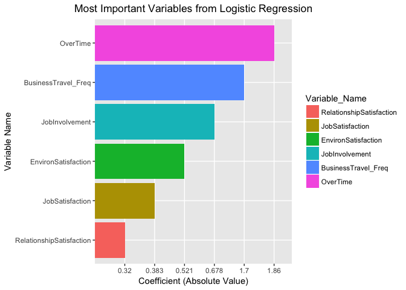<!-- -->

```r
# Calculate accuracy.
logi.pred <- predict(attr.logi, df.new[test,], type = "response")
logi.newpred <- rep("No", length(df.new$Attrition[test]))
logi.newpred[logi.pred > 0.60] = "Yes"
# Accuracy is 88.44% (the naive method has accuracy of 84.69%).
sum(logi.newpred == df.new$Attrition[test])/length(df.new$Attrition[test])
```

```
## [1] 0.8843537
```

#### Linear Discriminant Analysis Model (LDA)
Since our logistic regression model did not identify the same significant variables as the random forest model, we instead turned to a linear discriminant analysis model in order to look at how the variables identified in the random forest model differ between employees that left and those that stayed within the company (the probability of the X, given Y). Per LDA (and Naive Bayes), if the mean of an explanatory variable is very different between the response categories, then that explanatory variable can be useful for predicting the response. A table of the different means of the variables identified from our random forest does show that they differ considerably between employees that left and those that stayed (see table below).

Since LDA assumes that the explanatory variables are normally-distributed, however, we do not believe it will be accurate in its predictions (since there are many categorical variables in our model, and variables that are dummy encoded in a binary way are not Gaussian). And as expected, our LDA model had accuracy of 87.07% of our test set (lower than the logistic regression model).

```r
# *** Linear Discriminant Analysis ***
attr.lda <- lda(Attrition ~ ., data = df.new, subset = train)
attr.lda$means
```

```
##          Age DailyRate DistanceFromHome Education EnvironmentSatisfaction
## No  37.65346  811.2917         9.063008  2.934959                2.744919
## Yes 33.58333  750.6250        10.848958  2.828125                2.375000
##     HourlyRate JobInvolvement JobLevel JobSatisfaction MonthlyIncome
## No    65.93598       2.767276 2.154472        2.808943      6869.476
## Yes   64.98438       2.473958 1.609375        2.515625      4720.708
##     MonthlyRate NumCompaniesWorked PercentSalaryHike PerformanceRating
## No     14300.20           2.625000          15.27134          3.150407
## Yes    14387.74           2.989583          14.88542          3.151042
##     RelationshipSatisfaction StockOptionLevel TotalWorkingYears
## No                  2.744919        0.8526423         11.965447
## Yes                 2.552083        0.5156250          7.947917
##     TrainingTimesLastYear WorkLifeBalance YearsAtCompany
## No               2.822154        2.774390       7.445122
## Yes              2.614583        2.645833       4.817708
##     YearsInCurrentRole YearsSinceLastPromotion YearsWithCurrManager
## No            4.510163                2.224593             4.402439
## Yes           2.802083                1.880208             2.848958
##     BusinessTravelTravel_Frequently BusinessTravelTravel_Rarely
## No                         0.171748                   0.7195122
## Yes                        0.312500                   0.6250000
##     DepartmentResearch & Development DepartmentSales
## No                         0.6808943       0.2855691
## Yes                        0.5729167       0.3802083
##     EducationFieldLife Sciences EducationFieldMarketing
## No                    0.4390244               0.1006098
## Yes                   0.3906250               0.1510417
##     EducationFieldMedical EducationFieldOther
## No              0.3170732          0.05691057
## Yes             0.2552083          0.03645833
##     EducationFieldTechnical Degree GenderMale JobRoleHuman Resources
## No                      0.07520325  0.5873984              0.0254065
## Yes                     0.14062500  0.6041667              0.0468750
##     JobRoleLaboratory Technician JobRoleManager
## No                     0.1646341     0.08333333
## Yes                    0.2656250     0.02604167
##     JobRoleManufacturing Director JobRoleResearch Director
## No                     0.10162602              0.061991870
## Yes                    0.04166667              0.005208333
##     JobRoleResearch Scientist JobRoleSales Executive
## No                  0.2063008              0.2164634
## Yes                 0.2083333              0.2239583
##     JobRoleSales Representative MaritalStatusMarried MaritalStatusSingle
## No                   0.03658537            0.4786585           0.2804878
## Yes                  0.14583333            0.3333333           0.5312500
##     OverTimeYes
## No    0.2388211
## Yes   0.5156250
```

```r
# Data frame of the important variables from the random forest.
val.lda <- c('MonthlyIncome','Age','OverTime','DailyRate')
noavg.lda <- c(6869.48, 37.65, 0.24, 811.29)
yesavg.lda <- c(4720.71, 33.58, 0.52, 750.63)
lda.df <- data.frame(cbind(val.lda, noavg.lda, yesavg.lda))
names(lda.df) <- c('Variable','Avg Stay','Avg Leave')
lda.df
```

```
##        Variable Avg Stay Avg Leave
## 1 MonthlyIncome  6869.48   4720.71
## 2           Age    37.65     33.58
## 3      OverTime     0.24      0.52
## 4     DailyRate   811.29    750.63
```

```r
# Calculate accuracy.
lda.pred <- predict(attr.lda, df.new[test,])
# Accuracy is 87.07% (the naive method has accuracy of 84.69%).
sum(lda.pred$class == df.new$Attrition[test])/length(df.new$Attrition[test])
```

```
## [1] 0.8707483
```

### In Python
*Note that only 2 of many attempted models are displayed here. For more insights on some of the other models considered please look at case_study_two.md*

#### Extra Tree Classifier Model

This modeling technique is similar to Random Forrest except for the fact that random splits are tested as opposed to all possible splits. Extratrees are hence cheaper to train and can sometimes end up generalizing better.


```pextratreeclassifier
from sklearn.ensemble import ExtraTreesClassifier
# feature extraction
model = ExtraTreesClassifier()
fit = model.fit(X, Y)

importances = model.feature_importances_
print(importances)

idxs = np.argsort(importances)[-(number_of_features_to_select):]
features = np.asarray(columns_without_attrition[idxs])
print(list(reversed(features.tolist())))

predictions = model.predict(X_test)
print('Accuracy of extra trees classifier on test set: {:.5f}'.format(model.score(X_test, Y_test)))
```

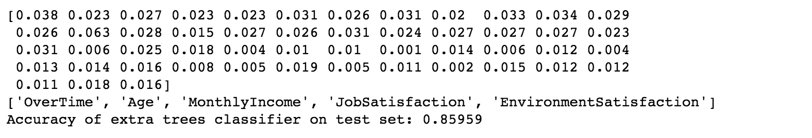

In order of most important features:
1. OverTime |
2. Age |
3. MontlyIncome |
4. JobSatisfaction |
5. EnvironmentSatisfaction

#### Logistic Regression Model

```plogisticregression
warnings.filterwarnings('ignore')

logreg = LogisticRegression()
logreg.fit(X, Y)

y_pred = logreg.predict(X_test)
print('Accuracy of logistic regression classifier on test set: {:.5f}'.format(logreg.score(X_test, Y_test)))

denom = (2.0*(1.0+np.cosh(logreg.decision_function(X))))
F_ij = np.dot((X/denom[:,None]).T,X) ## Fisher Information Matrix
Cramer_Rao = np.linalg.inv(F_ij) ## Inverse Information Matrix
sigma_estimates = np.array([np.sqrt(Cramer_Rao[i,i]) for i in range(Cramer_Rao.shape[0])]) # sigma for each coefficient
z_scores = logreg.coef_[0]/sigma_estimates # z-score for eaach model coefficient
p_values = [stat.norm.sf(abs(x))*2 for x in z_scores] ### two tailed test for p-values

print(sorted(list(zip(p_values, columns_without_attrition)))[:5])
```
**Accuracy of logistic regression classifier on test set: 0.85616**
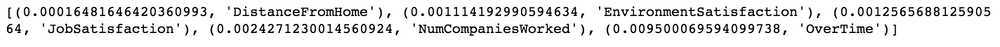
In order of most important features:
1. DistanceFromHome |
2. EnvironmentSatisfaction | 
3. JobSatisfaction | 
4. NumCompaniesWorked | 
5. Overtime

<center><h1>Interesting Trends - In Python</h1></center>

An analysis of trends in job roles, attrition, and other factors that were commonly featured in the models above.

#### YearsSinceLastPromotion and YearsInCurrentRole


```pyearssincelastpromvrole
sns.barplot(x="YearsSinceLastPromotion", y="JobRole", data=unchanged_attrition_df)
```
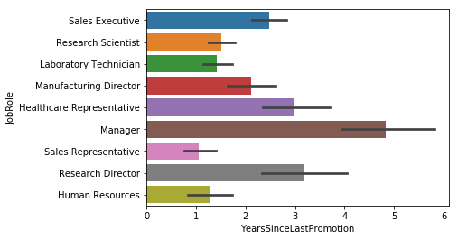

There seems to be a significant higher average YearSinceLastPromotion for people with roles that are Managerial or Executive.


```pyearssincelastpromvrolewattrition
sns.barplot(x="YearsSinceLastPromotion", y="JobRole",hue= "Attrition", data=unchanged_attrition_df)
```
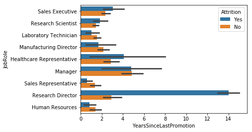
Research directors who have left their positions have an average of nearly 14 YearsSinceLastPromotion which is significantly greater than directors who are still in their position. Directorship positions often tend to be condsidered as very high position which may not result in promotions as often, it is important to consider high position roles for promotions on regular interval to more effectively maintain Research Directors.


```pyearsincurrentrole
sns.barplot(x="YearsInCurrentRole", y="JobRole", data=unchanged_attrition_df)
```
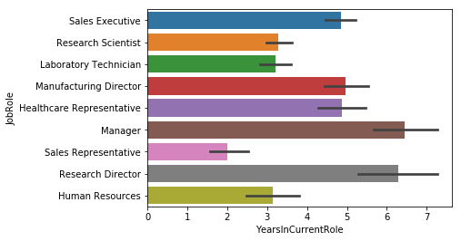
Higher level positions tend to have greater YearsInCurrentRoles as opposed to more junior to mid-level positions.


```pyearsincurrentrolewattrition
sns.barplot(x="YearsInCurrentRole", y="JobRole", hue= "Attrition", data=unchanged_attrition_df)
```
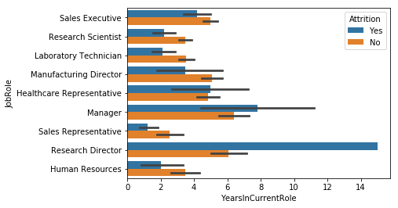
This relationship is similar to YearsSinceLastPromotion except that Managers are also considered as higher risk to leave when staying in the same role.

#### DistanceFromHome


```pdistancefromhome
sns.barplot(x="DistanceFromHome", y="JobRole", data=unchanged_attrition_df)
```


```pdistancefromhomewattrition
sns.barplot(x="DistanceFromHome", y="JobRole", hue= "Attrition", data=unchanged_attrition_df)
```
There is no relationship between job role and distance from home.

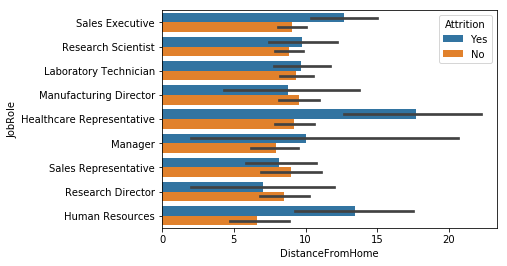
However, there is a trend that greater the distance from home the more likely someone is going to leave their job. It is evident in some positions more than others.

#### NumCompaniesWorked


```pnumcompaniesworked
sns.barplot(x="NumCompaniesWorked", y="JobRole", data=unchanged_attrition_df)
```

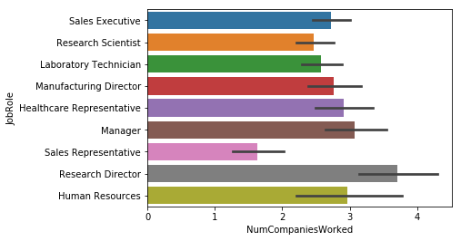


```numcompaniesworkedwattrition
sns.barplot(x="NumCompaniesWorked", y="JobRole", hue="Attrition", data=unchanged_attrition_df)
```

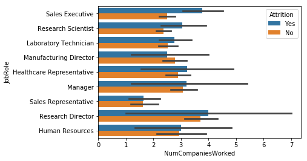
Sales executives who leave tend to work for nearly an average of two more companies that their counterparts who remain.

#### EnvironmentSatisfaction


```penvironmentsatisfaction
sns.barplotsns.barplot(x="EnvironmentSatisfaction", y="JobRole", data=unchanged_attrition_df)
```

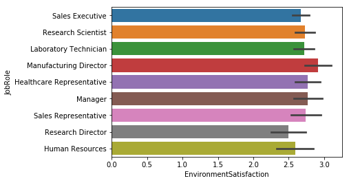


```penvironmentsatisfactionwattrition
sns.barplot(x="EnvironmentSatisfaction", y="JobRole",hue= "Attrition", data=unchanged_attrition_df)
```

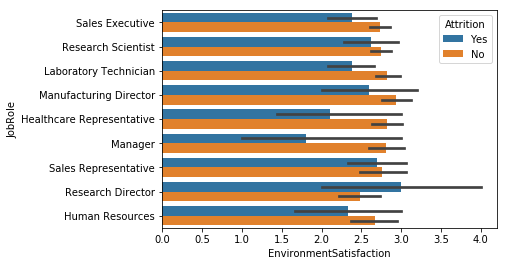
People who leave tend to have less environment satisfaction than their counterparts who stay.

#### Overtime


```povertimeattrition
sns.countplot(y="OverTime", hue="Attrition", data=unchanged_attrition_df)
```

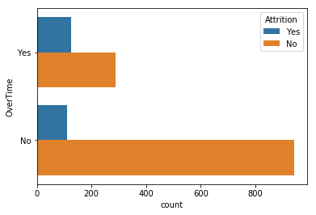
The overall ratio of people who left their job that worked overtime was significantly larger than the ration of people who did not leave their jobs.


```pjobroleovertimewattrition
sns.countplot(y="JobRole", hue="OverTime", data=unchanged_attrition_df)
```

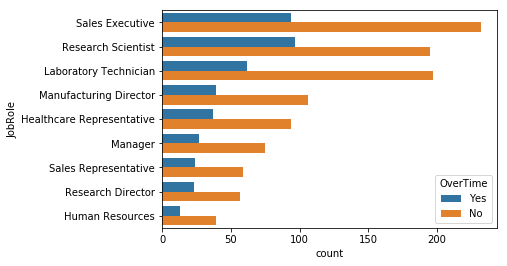
The ratio of people who work overtime regardless of their roles is much higher than their attrition rate by their role alone.

#### Age


```pageattrition
sns.barplot(x="Age", y="Attrition", data=unchanged_attrition_df)
```

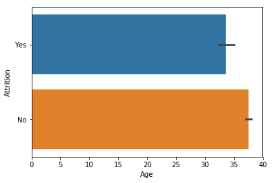


```pagejobrole
sns.barplot(x="Age", y="JobRole", data=unchanged_attrition_df)
```

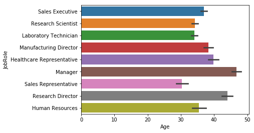


```pagejoberolewattrition
sns.barplot(x="Age", y="JobRole", hue="Attrition", data=unchanged_attrition_df)
```

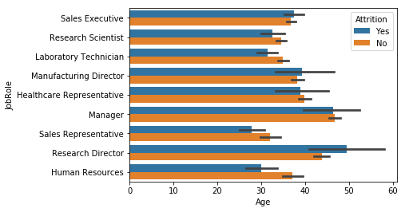

There is a trend that attrition is more likely for younger people however, those age trends are not as apparent based off role. Roles such as Research Directors have a higher average age for people who left their job while in Human resources the trend is the opposite.
