```python
import pandas as pd
import xlrd
import scipy
import numpy as np
import seaborn as sns
import matplotlib.pyplot as plt
import scipy.stats as stat
import warnings
from IPython.display import display
pd.options.display.max_columns = None
pd.options.display.max_rows = None
from sklearn.feature_selection import SelectKBest
from sklearn.feature_selection import SelectFromModel
from sklearn.feature_selection import chi2
from sklearn.feature_selection import RFE
from sklearn.linear_model import LogisticRegression
from sklearn import preprocessing
from sklearn.ensemble import RandomForestRegressor
from sklearn.ensemble import RandomForestClassifier
```

## Load and Clean Dataset


```python
file = 'CaseStudy2data.xlsx'

# Load spreadsheet
xl = pd.ExcelFile(file)

# Load a sheet into a DataFrame by name: df1
unchanged_attrition_df = xl.parse('HR-employee-attrition Data')
attrition_df = unchanged_attrition_df

#drop unneccessary columns with constant values
attrition_column = attrition_df["Attrition"]
attrition_df.drop("Attrition", axis=1, inplace=True)
attrition_df.insert(0, "Attrition", attrition_column)
attrition_df.drop('EmployeeCount', axis=1, inplace=True)
attrition_df.drop('StandardHours', axis=1, inplace=True)
attrition_df.drop('Over18', axis=1, inplace=True)

#convert attrition variable to binary
attrition_df = attrition_df.replace("Yes", 1)
attrition_df = attrition_df.replace("No", 0)

# code dummy variables, this is necessary to use sklearn
attrition_df = pd.get_dummies(attrition_df, columns=["BusinessTravel", "Department", "EducationField", "Gender", "JobRole", "MaritalStatus"], prefix=["BusinessTravel", "Department", "EduationField", "Gender", "JobRole", "MaritalStatus"])
df_without_attrition = attrition_df.drop("Attrition", axis=1)
columns_without_attrition = df_without_attrition.columns
columns_with_attrition = attrition_df.columns
attrition_df.head(10)
```


<div>
<style scoped>
    .dataframe tbody tr th:only-of-type {
        vertical-align: middle;
    }

    .dataframe tbody tr th {
        vertical-align: top;
    }

    .dataframe thead th {
        text-align: right;
    }
</style>
<table border="1" class="dataframe">
  <thead>
    <tr style="text-align: right;">
      <th></th>
      <th>Attrition</th>
      <th>Age</th>
      <th>DailyRate</th>
      <th>DistanceFromHome</th>
      <th>Education</th>
      <th>EmployeeNumber</th>
      <th>EnvironmentSatisfaction</th>
      <th>HourlyRate</th>
      <th>JobInvolvement</th>
      <th>JobLevel</th>
      <th>JobSatisfaction</th>
      <th>MonthlyIncome</th>
      <th>MonthlyRate</th>
      <th>NumCompaniesWorked</th>
      <th>OverTime</th>
      <th>PercentSalaryHike</th>
      <th>PerformanceRating</th>
      <th>RelationshipSatisfaction</th>
      <th>StockOptionLevel</th>
      <th>TotalWorkingYears</th>
      <th>TrainingTimesLastYear</th>
      <th>WorkLifeBalance</th>
      <th>YearsAtCompany</th>
      <th>YearsInCurrentRole</th>
      <th>YearsSinceLastPromotion</th>
      <th>YearsWithCurrManager</th>
      <th>BusinessTravel_Non-Travel</th>
      <th>BusinessTravel_Travel_Frequently</th>
      <th>BusinessTravel_Travel_Rarely</th>
      <th>Department_Human Resources</th>
      <th>Department_Research &amp; Development</th>
      <th>Department_Sales</th>
      <th>EduationField_Human Resources</th>
      <th>EduationField_Life Sciences</th>
      <th>EduationField_Marketing</th>
      <th>EduationField_Medical</th>
      <th>EduationField_Other</th>
      <th>EduationField_Technical Degree</th>
      <th>Gender_Female</th>
      <th>Gender_Male</th>
      <th>JobRole_Healthcare Representative</th>
      <th>JobRole_Human Resources</th>
      <th>JobRole_Laboratory Technician</th>
      <th>JobRole_Manager</th>
      <th>JobRole_Manufacturing Director</th>
      <th>JobRole_Research Director</th>
      <th>JobRole_Research Scientist</th>
      <th>JobRole_Sales Executive</th>
      <th>JobRole_Sales Representative</th>
      <th>MaritalStatus_Divorced</th>
      <th>MaritalStatus_Married</th>
      <th>MaritalStatus_Single</th>
    </tr>
  </thead>
  <tbody>
    <tr>
      <th>0</th>
      <td>1</td>
      <td>41</td>
      <td>1102</td>
      <td>1</td>
      <td>2</td>
      <td>1</td>
      <td>2</td>
      <td>94</td>
      <td>3</td>
      <td>2</td>
      <td>4</td>
      <td>5993</td>
      <td>19479</td>
      <td>8</td>
      <td>1</td>
      <td>11</td>
      <td>3</td>
      <td>1</td>
      <td>0</td>
      <td>8</td>
      <td>0</td>
      <td>1</td>
      <td>6</td>
      <td>4</td>
      <td>0</td>
      <td>5</td>
      <td>0</td>
      <td>0</td>
      <td>1</td>
      <td>0</td>
      <td>0</td>
      <td>1</td>
      <td>0</td>
      <td>1</td>
      <td>0</td>
      <td>0</td>
      <td>0</td>
      <td>0</td>
      <td>1</td>
      <td>0</td>
      <td>0</td>
      <td>0</td>
      <td>0</td>
      <td>0</td>
      <td>0</td>
      <td>0</td>
      <td>0</td>
      <td>1</td>
      <td>0</td>
      <td>0</td>
      <td>0</td>
      <td>1</td>
    </tr>
    <tr>
      <th>1</th>
      <td>0</td>
      <td>49</td>
      <td>279</td>
      <td>8</td>
      <td>1</td>
      <td>2</td>
      <td>3</td>
      <td>61</td>
      <td>2</td>
      <td>2</td>
      <td>2</td>
      <td>5130</td>
      <td>24907</td>
      <td>1</td>
      <td>0</td>
      <td>23</td>
      <td>4</td>
      <td>4</td>
      <td>1</td>
      <td>10</td>
      <td>3</td>
      <td>3</td>
      <td>10</td>
      <td>7</td>
      <td>1</td>
      <td>7</td>
      <td>0</td>
      <td>1</td>
      <td>0</td>
      <td>0</td>
      <td>1</td>
      <td>0</td>
      <td>0</td>
      <td>1</td>
      <td>0</td>
      <td>0</td>
      <td>0</td>
      <td>0</td>
      <td>0</td>
      <td>1</td>
      <td>0</td>
      <td>0</td>
      <td>0</td>
      <td>0</td>
      <td>0</td>
      <td>0</td>
      <td>1</td>
      <td>0</td>
      <td>0</td>
      <td>0</td>
      <td>1</td>
      <td>0</td>
    </tr>
    <tr>
      <th>2</th>
      <td>1</td>
      <td>37</td>
      <td>1373</td>
      <td>2</td>
      <td>2</td>
      <td>4</td>
      <td>4</td>
      <td>92</td>
      <td>2</td>
      <td>1</td>
      <td>3</td>
      <td>2090</td>
      <td>2396</td>
      <td>6</td>
      <td>1</td>
      <td>15</td>
      <td>3</td>
      <td>2</td>
      <td>0</td>
      <td>7</td>
      <td>3</td>
      <td>3</td>
      <td>0</td>
      <td>0</td>
      <td>0</td>
      <td>0</td>
      <td>0</td>
      <td>0</td>
      <td>1</td>
      <td>0</td>
      <td>1</td>
      <td>0</td>
      <td>0</td>
      <td>0</td>
      <td>0</td>
      <td>0</td>
      <td>1</td>
      <td>0</td>
      <td>0</td>
      <td>1</td>
      <td>0</td>
      <td>0</td>
      <td>1</td>
      <td>0</td>
      <td>0</td>
      <td>0</td>
      <td>0</td>
      <td>0</td>
      <td>0</td>
      <td>0</td>
      <td>0</td>
      <td>1</td>
    </tr>
    <tr>
      <th>3</th>
      <td>0</td>
      <td>33</td>
      <td>1392</td>
      <td>3</td>
      <td>4</td>
      <td>5</td>
      <td>4</td>
      <td>56</td>
      <td>3</td>
      <td>1</td>
      <td>3</td>
      <td>2909</td>
      <td>23159</td>
      <td>1</td>
      <td>1</td>
      <td>11</td>
      <td>3</td>
      <td>3</td>
      <td>0</td>
      <td>8</td>
      <td>3</td>
      <td>3</td>
      <td>8</td>
      <td>7</td>
      <td>3</td>
      <td>0</td>
      <td>0</td>
      <td>1</td>
      <td>0</td>
      <td>0</td>
      <td>1</td>
      <td>0</td>
      <td>0</td>
      <td>1</td>
      <td>0</td>
      <td>0</td>
      <td>0</td>
      <td>0</td>
      <td>1</td>
      <td>0</td>
      <td>0</td>
      <td>0</td>
      <td>0</td>
      <td>0</td>
      <td>0</td>
      <td>0</td>
      <td>1</td>
      <td>0</td>
      <td>0</td>
      <td>0</td>
      <td>1</td>
      <td>0</td>
    </tr>
    <tr>
      <th>4</th>
      <td>0</td>
      <td>27</td>
      <td>591</td>
      <td>2</td>
      <td>1</td>
      <td>7</td>
      <td>1</td>
      <td>40</td>
      <td>3</td>
      <td>1</td>
      <td>2</td>
      <td>3468</td>
      <td>16632</td>
      <td>9</td>
      <td>0</td>
      <td>12</td>
      <td>3</td>
      <td>4</td>
      <td>1</td>
      <td>6</td>
      <td>3</td>
      <td>3</td>
      <td>2</td>
      <td>2</td>
      <td>2</td>
      <td>2</td>
      <td>0</td>
      <td>0</td>
      <td>1</td>
      <td>0</td>
      <td>1</td>
      <td>0</td>
      <td>0</td>
      <td>0</td>
      <td>0</td>
      <td>1</td>
      <td>0</td>
      <td>0</td>
      <td>0</td>
      <td>1</td>
      <td>0</td>
      <td>0</td>
      <td>1</td>
      <td>0</td>
      <td>0</td>
      <td>0</td>
      <td>0</td>
      <td>0</td>
      <td>0</td>
      <td>0</td>
      <td>1</td>
      <td>0</td>
    </tr>
    <tr>
      <th>5</th>
      <td>0</td>
      <td>32</td>
      <td>1005</td>
      <td>2</td>
      <td>2</td>
      <td>8</td>
      <td>4</td>
      <td>79</td>
      <td>3</td>
      <td>1</td>
      <td>4</td>
      <td>3068</td>
      <td>11864</td>
      <td>0</td>
      <td>0</td>
      <td>13</td>
      <td>3</td>
      <td>3</td>
      <td>0</td>
      <td>8</td>
      <td>2</td>
      <td>2</td>
      <td>7</td>
      <td>7</td>
      <td>3</td>
      <td>6</td>
      <td>0</td>
      <td>1</td>
      <td>0</td>
      <td>0</td>
      <td>1</td>
      <td>0</td>
      <td>0</td>
      <td>1</td>
      <td>0</td>
      <td>0</td>
      <td>0</td>
      <td>0</td>
      <td>0</td>
      <td>1</td>
      <td>0</td>
      <td>0</td>
      <td>1</td>
      <td>0</td>
      <td>0</td>
      <td>0</td>
      <td>0</td>
      <td>0</td>
      <td>0</td>
      <td>0</td>
      <td>0</td>
      <td>1</td>
    </tr>
    <tr>
      <th>6</th>
      <td>0</td>
      <td>59</td>
      <td>1324</td>
      <td>3</td>
      <td>3</td>
      <td>10</td>
      <td>3</td>
      <td>81</td>
      <td>4</td>
      <td>1</td>
      <td>1</td>
      <td>2670</td>
      <td>9964</td>
      <td>4</td>
      <td>1</td>
      <td>20</td>
      <td>4</td>
      <td>1</td>
      <td>3</td>
      <td>12</td>
      <td>3</td>
      <td>2</td>
      <td>1</td>
      <td>0</td>
      <td>0</td>
      <td>0</td>
      <td>0</td>
      <td>0</td>
      <td>1</td>
      <td>0</td>
      <td>1</td>
      <td>0</td>
      <td>0</td>
      <td>0</td>
      <td>0</td>
      <td>1</td>
      <td>0</td>
      <td>0</td>
      <td>1</td>
      <td>0</td>
      <td>0</td>
      <td>0</td>
      <td>1</td>
      <td>0</td>
      <td>0</td>
      <td>0</td>
      <td>0</td>
      <td>0</td>
      <td>0</td>
      <td>0</td>
      <td>1</td>
      <td>0</td>
    </tr>
    <tr>
      <th>7</th>
      <td>0</td>
      <td>30</td>
      <td>1358</td>
      <td>24</td>
      <td>1</td>
      <td>11</td>
      <td>4</td>
      <td>67</td>
      <td>3</td>
      <td>1</td>
      <td>3</td>
      <td>2693</td>
      <td>13335</td>
      <td>1</td>
      <td>0</td>
      <td>22</td>
      <td>4</td>
      <td>2</td>
      <td>1</td>
      <td>1</td>
      <td>2</td>
      <td>3</td>
      <td>1</td>
      <td>0</td>
      <td>0</td>
      <td>0</td>
      <td>0</td>
      <td>0</td>
      <td>1</td>
      <td>0</td>
      <td>1</td>
      <td>0</td>
      <td>0</td>
      <td>1</td>
      <td>0</td>
      <td>0</td>
      <td>0</td>
      <td>0</td>
      <td>0</td>
      <td>1</td>
      <td>0</td>
      <td>0</td>
      <td>1</td>
      <td>0</td>
      <td>0</td>
      <td>0</td>
      <td>0</td>
      <td>0</td>
      <td>0</td>
      <td>1</td>
      <td>0</td>
      <td>0</td>
    </tr>
    <tr>
      <th>8</th>
      <td>0</td>
      <td>38</td>
      <td>216</td>
      <td>23</td>
      <td>3</td>
      <td>12</td>
      <td>4</td>
      <td>44</td>
      <td>2</td>
      <td>3</td>
      <td>3</td>
      <td>9526</td>
      <td>8787</td>
      <td>0</td>
      <td>0</td>
      <td>21</td>
      <td>4</td>
      <td>2</td>
      <td>0</td>
      <td>10</td>
      <td>2</td>
      <td>3</td>
      <td>9</td>
      <td>7</td>
      <td>1</td>
      <td>8</td>
      <td>0</td>
      <td>1</td>
      <td>0</td>
      <td>0</td>
      <td>1</td>
      <td>0</td>
      <td>0</td>
      <td>1</td>
      <td>0</td>
      <td>0</td>
      <td>0</td>
      <td>0</td>
      <td>0</td>
      <td>1</td>
      <td>0</td>
      <td>0</td>
      <td>0</td>
      <td>0</td>
      <td>1</td>
      <td>0</td>
      <td>0</td>
      <td>0</td>
      <td>0</td>
      <td>0</td>
      <td>0</td>
      <td>1</td>
    </tr>
    <tr>
      <th>9</th>
      <td>0</td>
      <td>36</td>
      <td>1299</td>
      <td>27</td>
      <td>3</td>
      <td>13</td>
      <td>3</td>
      <td>94</td>
      <td>3</td>
      <td>2</td>
      <td>3</td>
      <td>5237</td>
      <td>16577</td>
      <td>6</td>
      <td>0</td>
      <td>13</td>
      <td>3</td>
      <td>2</td>
      <td>2</td>
      <td>17</td>
      <td>3</td>
      <td>2</td>
      <td>7</td>
      <td>7</td>
      <td>7</td>
      <td>7</td>
      <td>0</td>
      <td>0</td>
      <td>1</td>
      <td>0</td>
      <td>1</td>
      <td>0</td>
      <td>0</td>
      <td>0</td>
      <td>0</td>
      <td>1</td>
      <td>0</td>
      <td>0</td>
      <td>0</td>
      <td>1</td>
      <td>1</td>
      <td>0</td>
      <td>0</td>
      <td>0</td>
      <td>0</td>
      <td>0</td>
      <td>0</td>
      <td>0</td>
      <td>0</td>
      <td>0</td>
      <td>1</td>
      <td>0</td>
    </tr>
  </tbody>
</table>
</div>


## Split into Train and Test Set


```python
rand = np.random.rand(len(attrition_df)) < 0.8

train = attrition_df[rand]
test = attrition_df[~rand]

print(train.shape)
print(test.shape)
```

    (1178, 52)
    (292, 52)


## Data Exploration


```python
plt.figure(figsize = (20,20))
corr = attrition_df.corr()
sns.heatmap(corr[(corr >= 0.6) | (corr <= -0.6)], 
        xticklabels=columns_with_attrition,
        yticklabels=columns_with_attrition, linewidths=.6)
```


    <matplotlib.axes._subplots.AxesSubplot at 0x11a6493c8>


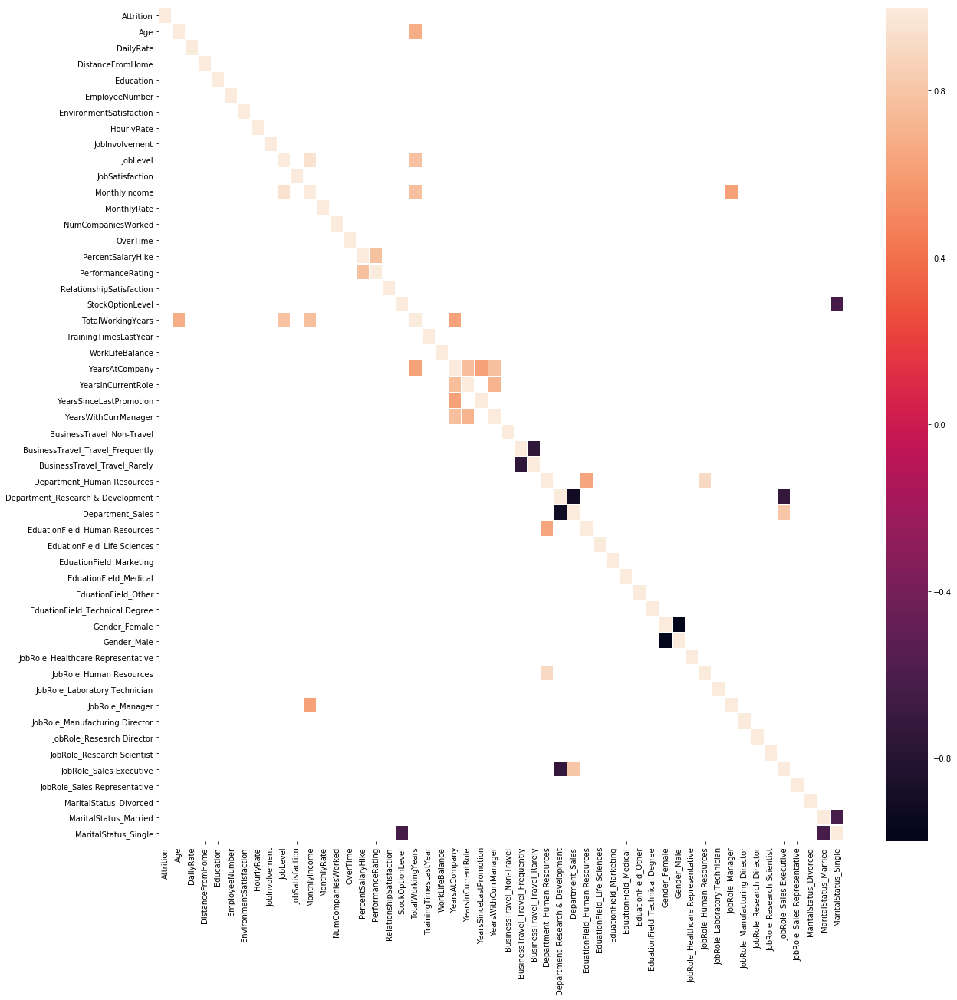


Based off looking at the correlation heatmap above, there are not any values that stand out as extremly correlated (0.8). Thus no variables will be removed.


```python
sns.countplot(x='Attrition',data=attrition_df)
plt.show()
```


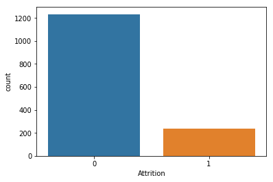


```python
sns.countplot(y="JobRole", data=unchanged_attrition_df)
plt.show()
```


```python
income = unchanged_attrition_df.groupby('JobRole').mean()[['MonthlyIncome']].values
flattened_income = []
for i in income:
    flattened_income.append(i[0])
    
roles = ['Healthcare Representative', 'Human Resources', 'Labrator Technician', 'Manager', 'Manufacturing Director', 'Research Director', 'Research Scientist' , 'Sales Executive','Sales Representative']

y_pos = np.arange(len(roles))

plt.xlabel('Average Monthly Income')
plt.ylabel('Job Role')
 
# Create horizontal bars
plt.barh(y_pos, flattened_income)
 
# Create names on the y-axis
plt.yticks(y_pos, roles)
 
# Show graphic
plt.show()
```


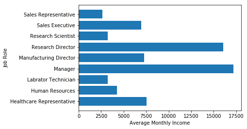


## Modeling

### Recursive Feature Elimination


```python
np.set_printoptions(precision=3)

values = train.values

X = values[:,1:(len(train.columns))]
Y = values[:,0]

test_values = test.values
X_test = test_values[:,1:(len(test.columns))]
Y_test = test_values[:,0]


number_of_features_to_select = 5
# feature extraction
model = LogisticRegression()
rfe = RFE(model, number_of_features_to_select)
fit = rfe.fit(X, Y)
print(fit.support_)
print(fit.ranking_)
true_indexes = [i for i, x in enumerate(fit.support_) if x == True]
features = np.asarray(columns_without_attrition[true_indexes])
print(features)

predictions = rfe.predict(X_test)
print('Accuracy of RFE on test set: {:.5f}'.format(fit.score(X_test, Y_test)))

```

    [False False False False False False False False False False False False
     False  True False False False False False False False False False False
     False False False False False False False False False False False False
     False False False False  True  True False False False False False  True
     False False  True]
    [40 44 37 41 46 10 43  5  6  8 45 47 31  1 35 25 26 30 33 24 12 34 27 28
     32  9  2 23 16 17 15 18 42 29 36 39  3 20  7 19  1  1 22 14 11 21  4  1
     13 38  1]
    ['OverTime' 'JobRole_Human Resources' 'JobRole_Laboratory Technician'
     'JobRole_Sales Representative' 'MaritalStatus_Single']
    Accuracy of RFE on test set: 0.85959


### Feature Importance With ExtraTreesClassifier


```python
from sklearn.ensemble import ExtraTreesClassifier
# feature extraction
model = ExtraTreesClassifier()
fit = model.fit(X, Y)

importances = model.feature_importances_
print(importances)

idxs = np.argsort(importances)[-(number_of_features_to_select):]
features = np.asarray(columns_without_attrition[idxs])
print(list(reversed(features.tolist())))

predictions = model.predict(X_test)
print('Accuracy of extra trees classifier on test set: {:.5f}'.format(model.score(X_test, Y_test)))

```

    [0.038 0.023 0.027 0.023 0.023 0.031 0.026 0.031 0.02  0.033 0.034 0.029
     0.026 0.063 0.028 0.015 0.027 0.026 0.031 0.024 0.027 0.027 0.027 0.023
     0.031 0.006 0.025 0.018 0.004 0.01  0.01  0.001 0.014 0.006 0.012 0.004
     0.013 0.014 0.016 0.008 0.005 0.019 0.005 0.011 0.002 0.015 0.012 0.012
     0.011 0.018 0.016]
    ['OverTime', 'Age', 'MonthlyIncome', 'JobSatisfaction', 'EnvironmentSatisfaction']
    Accuracy of extra trees classifier on test set: 0.85959


### Random Forrest


```python
clf = RandomForestClassifier(n_jobs=2, random_state=0)
clf.fit(X, Y)

clf.predict(X_test)

train.describe()
test.describe()
preds = clf.predict_proba(X_test)

predictions = []
attrition_count = 0
not_attrition_count = 0
for pred in preds:
    if pred[0] >= pred[1]:
        not_attrition_count = not_attrition_count + 1
        predictions.append('No Attrition') 
    else:
        attrition_count = attrition_count + 1
        predictions.append('Attrition')
    
print("Attrition count: ")
print(attrition_count)
print("Not Attrition count: ")
print(not_attrition_count)
print('Accuracy of random forrest on test set: {:.5f}'.format(clf.score(X_test, Y_test)))
print(sorted(zip(map(lambda x: round(x, 4), clf.feature_importances_), columns_without_attrition), reverse=True)[:5])


```

    Attrition count: 
    14
    Not Attrition count: 
    278
    Accuracy of random forrest on test set: 0.85959
    [(0.0819, 'MonthlyIncome'), (0.0628, 'Age'), (0.0508, 'MonthlyRate'), (0.0481, 'HourlyRate'), (0.0455, 'OverTime')]


### Logistic Regression


```python
warnings.filterwarnings('ignore')

logreg = LogisticRegression()
logreg.fit(X, Y)

y_pred = logreg.predict(X_test)
print('Accuracy of logistic regression classifier on test set: {:.5f}'.format(logreg.score(X_test, Y_test)))

```

    Accuracy of logistic regression classifier on test set: 0.85616


```python
denom = (2.0*(1.0+np.cosh(logreg.decision_function(X))))
F_ij = np.dot((X/denom[:,None]).T,X) ## Fisher Information Matrix
Cramer_Rao = np.linalg.inv(F_ij) ## Inverse Information Matrix
sigma_estimates = np.array([np.sqrt(Cramer_Rao[i,i]) for i in range(Cramer_Rao.shape[0])]) # sigma for each coefficient
z_scores = logreg.coef_[0]/sigma_estimates # z-score for eaach model coefficient
p_values = [stat.norm.sf(abs(x))*2 for x in z_scores] ### two tailed test for p-values

print(sorted(list(zip(p_values, columns_without_attrition)))[:5])
```

    [(0.00016481646420360993, 'DistanceFromHome'), (0.001114192990594634, 'EnvironmentSatisfaction'), (0.001256568812590564, 'JobSatisfaction'), (0.0024271230014560924, 'NumCompaniesWorked'), (0.009500069594099738, 'OverTime')]


## Interesting Trends

We will looks at trends in job roles vs some of the factors that were selected in the different models.


```python
sns.barplot(x="YearsSinceLastPromotion", y="JobRole", data=unchanged_attrition_df)
```


    <matplotlib.axes._subplots.AxesSubplot at 0x11cb5ca58>


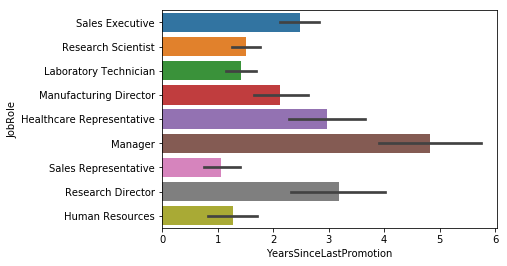


```python
sns.barplot(x="YearsSinceLastPromotion", y="JobRole",hue= "Attrition", data=unchanged_attrition_df)
```


    <matplotlib.axes._subplots.AxesSubplot at 0x11cd804e0>


```python
sns.barplot(x="YearsInCurrentRole", y="JobRole", data=unchanged_attrition_df)
```


    <matplotlib.axes._subplots.AxesSubplot at 0x11ceb7a58>


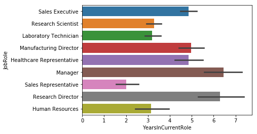


```python
sns.barplot(x="YearsInCurrentRole", y="JobRole", hue= "Attrition", data=unchanged_attrition_df)
```


    <matplotlib.axes._subplots.AxesSubplot at 0x11cfbf438>


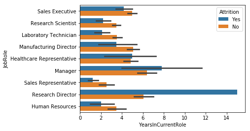


```python
unchanged_attrition_df.corr()[["YearsSinceLastPromotion"]]["YearsInCurrentRole":"YearsInCurrentRole"]
```


<div>
<style scoped>
    .dataframe tbody tr th:only-of-type {
        vertical-align: middle;
    }

    .dataframe tbody tr th {
        vertical-align: top;
    }

    .dataframe thead th {
        text-align: right;
    }
</style>
<table border="1" class="dataframe">
  <thead>
    <tr style="text-align: right;">
      <th></th>
      <th>YearsSinceLastPromotion</th>
    </tr>
  </thead>
  <tbody>
    <tr>
      <th>YearsInCurrentRole</th>
      <td>0.548056</td>
    </tr>
  </tbody>
</table>
</div>


```python
sns.barplot(x="DistanceFromHome", y="JobRole", data=unchanged_attrition_df)
```


    <matplotlib.axes._subplots.AxesSubplot at 0x11d104780>


```python
sns.barplot(x="DistanceFromHome", y="JobRole", hue= "Attrition", data=unchanged_attrition_df)
```


    <matplotlib.axes._subplots.AxesSubplot at 0x11d214240>


```python
sns.barplot(x="NumCompaniesWorked", y="JobRole", data=unchanged_attrition_df)
```


    <matplotlib.axes._subplots.AxesSubplot at 0x11d340ac8>


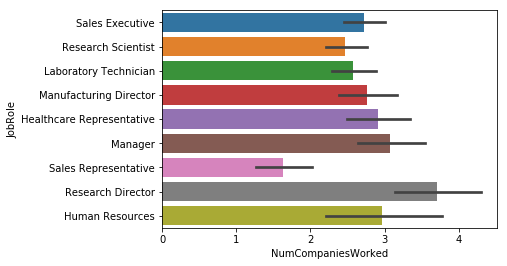


```python
sns.barplot(x="NumCompaniesWorked", y="JobRole", hue="Attrition", data=unchanged_attrition_df)
```


    <matplotlib.axes._subplots.AxesSubplot at 0x11d32c080>


```python
sns.barplot(x="EnvironmentSatisfaction", y="JobRole", data=unchanged_attrition_df)
```


    <matplotlib.axes._subplots.AxesSubplot at 0x11d5865f8>


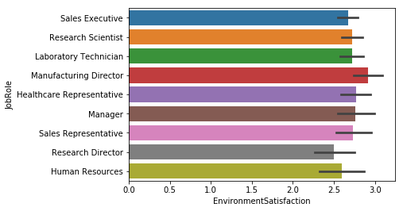


```python
sns.barplot(x="EnvironmentSatisfaction", y="JobRole",hue= "Attrition", data=unchanged_attrition_df)
```


    <matplotlib.axes._subplots.AxesSubplot at 0x11d695470>


```python
sns.countplot(y="OverTime", hue="Attrition", data=unchanged_attrition_df)
```


    <matplotlib.axes._subplots.AxesSubplot at 0x11d798048>


```python
sns.countplot(y="JobRole", hue="OverTime", data=unchanged_attrition_df)
```


    <matplotlib.axes._subplots.AxesSubplot at 0x11d8a4128>


```python
sns.barplot(x="Age", y="Attrition", data=unchanged_attrition_df)
```


    <matplotlib.axes._subplots.AxesSubplot at 0x11d92a908>


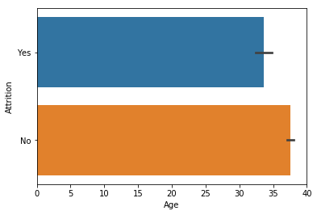


```python
sns.barplot(x="Age", y="JobRole", data=unchanged_attrition_df)
```


    <matplotlib.axes._subplots.AxesSubplot at 0x11da0d240>


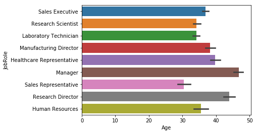


```python
sns.barplot(x="Age", y="JobRole", hue="Attrition", data=unchanged_attrition_df)
```


    <matplotlib.axes._subplots.AxesSubplot at 0x11daf5240>


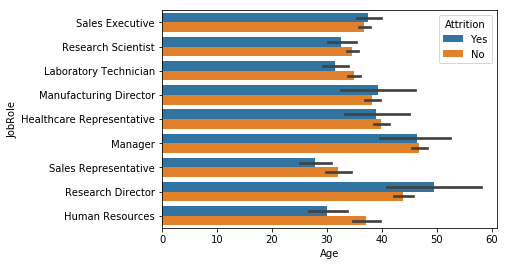

